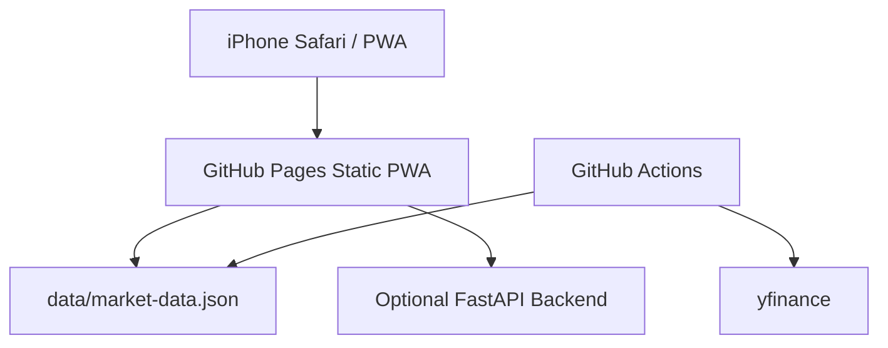

# System Design

## Architecture



## Target Returns

| Period | Target |
|---|---:|
| Weekly | +10% |
| Monthly | +50% |
| Half year | +300% |

## Prediction Logic

The GitHub Pages version uses price and volume data that is refreshed by GitHub Actions. Since static hosting cannot reliably fetch all financial data from the browser, the default model focuses on factors that can be measured from daily price and volume history.

### Factors

| UI Label | Internal Factor | Purpose |
|---|---|---|
| 押し目余地 | Dip room | Avoid buying too far below/above recent highs |
| 過熱回避 | Heat control | Penalize overextended monthly moves |
| 値動き安定 | Stability | Prefer names with manageable volatility |
| 上昇継続力 | Continuation | Combine 1M, 3M, and 6M trend strength |
| トレンド | Moving-average trend | Reward 5/25/75 day alignment |
| 出来高確認 | Volume confirmation | Reward volume expansion |
| モメンタム | Momentum | Reward recent return and breakout behavior |

### Period Presets

| Period | Emphasis |
|---|---|
| Weekly | Momentum, volume, short trend, overheating control |
| Monthly | Trend continuation, medium momentum, stability |
| Half year | Long trend, continuation, stability, lower volume weight |

### Formula

```text
raw_score =
  w_dip * dip_score
+ w_heat * heat_score
+ w_stability * stability_score
+ w_continuation * continuation_score
+ w_trend * trend_score
+ w_volume * volume_score
+ w_momentum * momentum_score
```

The app converts `raw_score` into an expected upside value.

```text
probability = 100 / (1 + exp(-k * raw_score))
expected_upside = probability / 100 * target_return
```

The screen shows only `expected_upside` and a simple priority grade so users do not need to interpret internal scores.

## Production Database Design

The static Pages version reads `data/market-data.json`. A production API version can add these tables:

```text
stocks(id, symbol, name, market, sector, currency)
price_history(id, stock_id, date, open, high, low, close, volume)
financial_metrics(id, stock_id, date, per, pbr, roe, sales_growth)
predictions(id, stock_id, period_type, period_slot, expected_upside, actual_return, created_at)
coefficient_sets(id, user_id, name, period_type, coefficients_json, created_at)
backtest_results(id, period_type, market, hit_rate, average_return, max_drawdown, sample_size, created_at)
```
