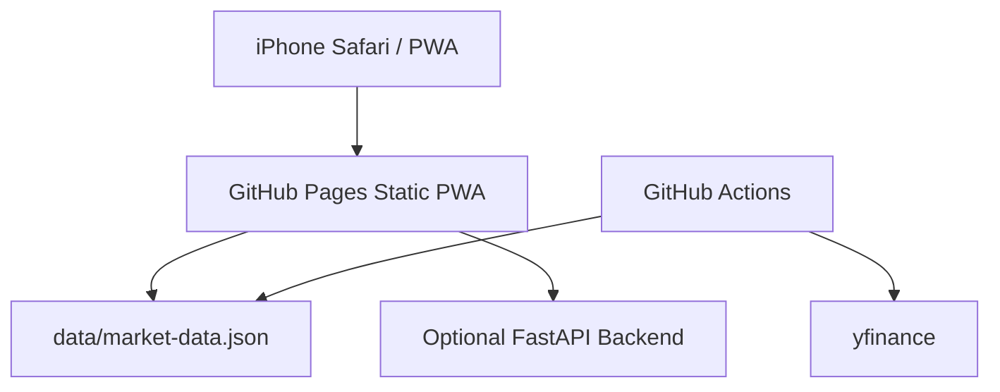

# System Design

## Architecture



## Target Returns

| Period | Target |
|---|---:|
| Weekly | +10% |
| Monthly | +50% |
| Half year | +300% |

## Prediction Logic

The GitHub Pages version uses price and volume data that is refreshed by GitHub Actions. Since static hosting cannot reliably fetch all financial data from the browser, the default model focuses on factors that can be measured from daily price and volume history.

The current model is an ensemble of specialist viewpoints:

| Specialist | Question |
|---|---|
| Trend follower | Is the 5/25/75 day trend aligned upward? |
| Momentum trader | Is recent performance strong without being a one-day spike? |
| Volume analyst | Is the move confirmed by rising volume? |
| Risk manager | Is volatility and drawdown acceptable? |
| Entry strategist | Is this a healthy pullback or breakout entry? |
| Continuation analyst | Is the 1M/3M/6M trend persistent? |
| Overheat controller | Is the stock too extended to chase? |

## Coverage Universe

The app does not scan every listed stock. Instead, it uses a broad recommended universe designed to reduce missed candidates while avoiding illiquid noise.

| Market | Coverage |
|---|---:|
| Japan | All ordinary domestic equities fetched from the JPX listed company universe |
| United States | 500 large-cap and mid/large-cap growth, AI/semiconductor, software, fintech, healthcare, industrial, travel, energy, consumer, financial, utility, and real-estate names |

The Japan universe is now designed to follow the JPX official listed company file rather than a hand-picked list. The US universe remains capped at 500 names for responsiveness and data size.

### Factors

| UI Label | Internal Factor | Purpose |
|---|---|---|
| 押し目余地 | Entry score | Reward healthy pullbacks above trend and controlled breakouts |
| 過熱回避 | Heat score | Penalize overextended 1W/1M moves |
| 値動き安定 | Risk score | Prefer manageable volatility and drawdown |
| 上昇継続力 | Continuation score | Combine 1M, 3M, 6M returns and up-day consistency |
| トレンド | Trend score | Reward 5/25/75 day moving-average alignment |
| 出来高確認 | Volume score | Reward volume expansion with positive price action |
| モメンタム | Momentum score | Reward 1W/2W/1M return and high breakout behavior |

### Period Presets

| Period | Emphasis |
|---|---|
| Weekly | Momentum, volume, short trend, overheating control |
| Monthly | Trend, continuation, stability, moderate momentum |
| Half year | Continuation, long trend, stability, lower volume/momentum weight |

### Formula

```text
raw_score =
  w_dip * dip_score
+ w_heat * heat_score
+ w_stability * stability_score
+ w_continuation * continuation_score
+ w_trend * trend_score
+ w_volume * volume_score
+ w_momentum * momentum_score
```

The app converts `raw_score` into an expected upside value.

```text
probability = 100 / (1 + exp(-k * raw_score))
expected_upside = probability / 100 * target_return
```

The screen shows only `expected_upside` and a simple priority grade so users do not need to interpret internal scores.

## Production Database Design

The static Pages version reads `data/market-data.json`. A production API version can add these tables:

```text
stocks(id, symbol, name, market, sector, currency)
price_history(id, stock_id, date, open, high, low, close, volume)
financial_metrics(id, stock_id, date, per, pbr, roe, sales_growth)
predictions(id, stock_id, period_type, period_slot, expected_upside, actual_return, created_at)
coefficient_sets(id, user_id, name, period_type, coefficients_json, created_at)
backtest_results(id, period_type, market, hit_rate, average_return, max_drawdown, sample_size, created_at)
```
