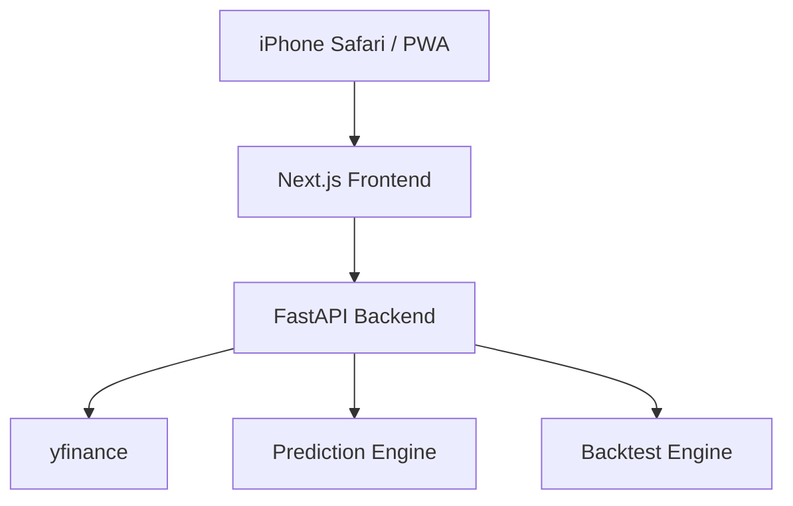

# System Design

## Architecture



## Target Returns

| Period | Target |
|---|---:|
| Weekly | +10% |
| Monthly | +50% |
| Half year | +300% |

## Algorithm

The engine combines value and momentum factors.

```text
score =
  w_per * per_score
+ w_pbr * pbr_score
+ w_roe * roe_score
+ w_sales_growth * sales_growth_score
+ w_moving_average * moving_average_score
+ w_volume * volume_score
+ w_momentum * momentum_score
```

The score is converted to a probability with a sigmoid function.

```text
probability = 100 / (1 + exp(-k * score))
```

## Database Design For Production

初期実装はAPI実行時にyfinanceから取得します。本番では以下のテーブルを追加します。

```text
stocks(id, symbol, name, market, sector, currency)
price_history(id, stock_id, date, open, high, low, close, volume)
financial_metrics(id, stock_id, date, per, pbr, roe, sales_growth)
predictions(id, stock_id, period_type, period_slot, probability, predicted_return, actual_return, created_at)
coefficient_sets(id, user_id, name, period_type, coefficients_json, created_at)
backtest_results(id, period_type, market, hit_rate, average_return, max_drawdown, sample_size, created_at)
```
